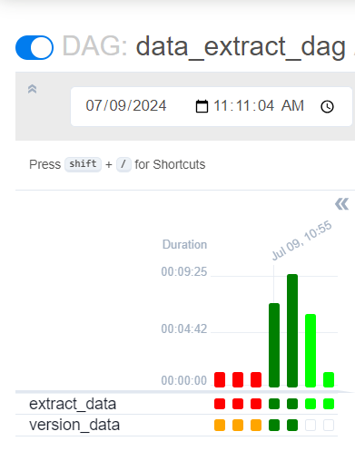
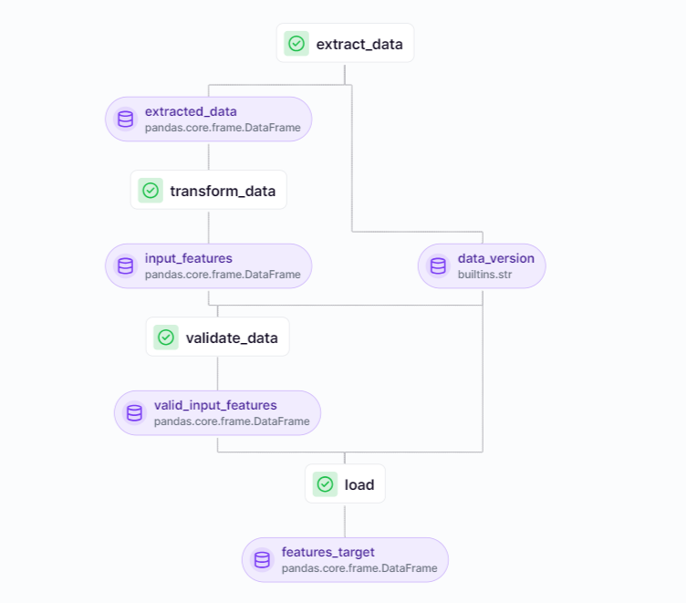

# TM5MLOops

### Background

The current process for pricing Airbnb accommodations is often inconsistent, leading to listings that are either 
overpriced and stay vacant or underpriced, causing potential revenue loss for hosts. 

This project aims to identify the key factors influencing Airbnb pricing using an extensive dataset of global accommodations. By understanding what drives pricing variability and how it impacts revenue, we aim to develop a model that helps hosts price their properties competitively and realistically. This will enhance hosts' revenue optimization strategies and improve occupancy rates.

### Our pipeline

Our pipeline consist now of two phases: data extraction and data preparation. We use *Apache Airflow* to orchestrate an 
execution of our phases\jobs, and *zenml* for data preparation phase. Yet we have run all the pipeline steps except one,
which requires `zenml` library, since we encounter a problem about dependencies. *Apache Airflow* requires different version
of libraries, while *zenml* other, and since they both go as python package, therefore it is hard to separate them. We 
tried to run *Apache Airflow* locally and via docker, however the issue with dependencies persist.



Fortunately, when we run *zenml* pipeline alone, it works. Our data preparation pipeline looks as follows: 



How it works:
- `extract_data` prepares a dataframe to work with in next steps,
- `transform_data` fills missing values and adjust feature values,
- `validate_data` validate if data transformation is applied correctly,
- `load` loads\saves artifacts for future analysis (model training)

Example of artifacts:
```azure
$ zenml artifact list
┏━━━━━━━━━━━━━━━━━━━━━━━━━━━━━━━━━━━━━━┯━━━━━━━━━━━━━━━━━━━━━━┯━━━━━━━━━━━━━━━━━━━━━━┓
┃                  ID                  │ NAME                 │ TAGS                 ┃
┠──────────────────────────────────────┼──────────────────────┼──────────────────────┨
┃ 8fd383bd-9bb0-4ed7-8c22-ba8a65b20891 │ extracted_data       │ ['data_preparation'] ┃
┠──────────────────────────────────────┼──────────────────────┼──────────────────────┨
┃ 2a6ca3a5-cd20-43a9-b1f4-e6ed46b81ea8 │ data_version         │ ['data_preparation'] ┃
┠──────────────────────────────────────┼──────────────────────┼──────────────────────┨
┃ dc80a34c-92f7-401d-8b18-ec8d8ac4f10b │ input_features       │ ['data_preparation'] ┃
┠──────────────────────────────────────┼──────────────────────┼──────────────────────┨
┃ aef284ff-84cf-4d6e-93a8-8a360ed08652 │ valid_input_features │ ['data_preparation'] ┃
┠──────────────────────────────────────┼──────────────────────┼──────────────────────┨
┃ 745144bd-08b4-4091-8c9d-672ac612877a │ features_target      │ ['1.7']              ┃
┗━━━━━━━━━━━━━━━━━━━━━━━━━━━━━━━━━━━━━━┷━━━━━━━━━━━━━━━━━━━━━━┷━━━━━━━━━━━━━━━━━━━━━━┛
```