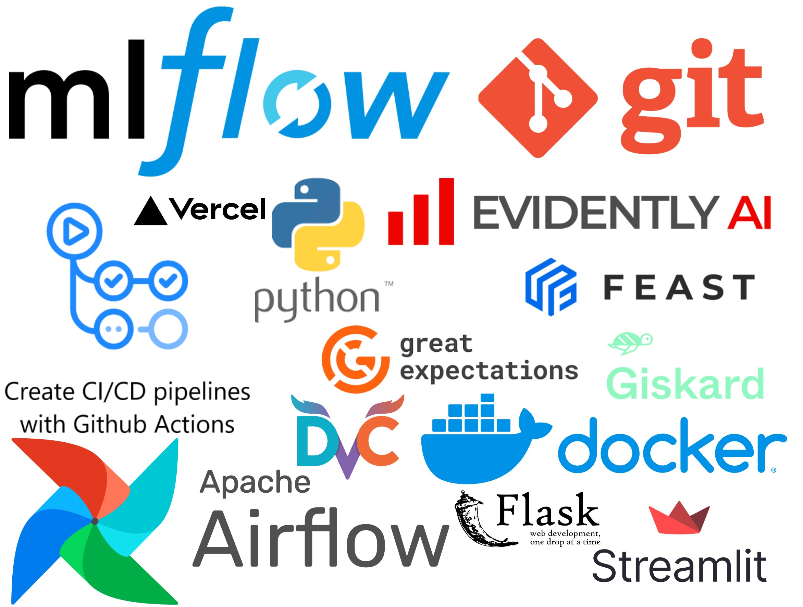

# Airbnb AI Pricing


## Introduction

---

This project aims to address the inconsistent pricing of Airbnb listings, which can lead to properties being overpriced or underpriced. By analyzing a comprehensive dataset of global accommodations, we aim to identify key factors influencing Airbnb pricing. Our goal is to develop a model that helps hosts price their properties competitively and realistically, thereby optimizing revenue and improving occupancy rates. This data-driven approach will benefit both hosts and guests by providing a reliable and efficient pricing strategy.

## Motivation

---

Inconsistent pricing affects both individual hosts and the overall perception of Airbnb as a platform. A data-driven approach to pricing can provide significant benefits, including increased revenue, improved occupancy rates, and a better guest experience.

## Our Project Core

---

We applied the CRISP-ML process on this project which begins with business and data understanding till model deployment 
and monitoring. The phases of the process are as follows:

1. **Business and data understanding**
    - Elicit the project requirements and formulate business problem
    - Specify business goals and machine learning goals
    - Determine the success criteria for business and machine learning modeling 
    - Analyse the risks and set mitigation approaches

2. **Data engineering/Preparation** 
    - Create ETL pipelines using Apache Airflow
    - Perform data transformation
    - Check the quality of the data and perform data cleaning
    - Create ML-ready features and store them in feature stores such as feast
   
3. **Model engineering**
    - Select and build ML models
    - Perform and track experiments using MLflow
    - Optimize models and select best models
    - model versioning in model registry of MLflow

4. **Model validation**
    - Prepare one model for production
    - Check the success criteria of machine learning
    - Check the business and machine learning modeling objectives
    - The business stakeholders take part in this phase
    - Check if deploying the model is feasible
    - Check the quality of the model for production
    - Select one model to be deployed

5. **Model deployment**
    - Search for options available to serve the model
    - Deploy the model
    - Create a REST endpoint for your model prediction using Flask or FastAPI
    - Create a UI for your model using streamlit or pure HTML and JS.
    - Create a CI/CD pipeline for your model using Github Actions and Docker
  
### Models
Using these links you can access our drive where the models are stored. 

[Random Forest Champion](https://drive.google.com/file/d/1-sM-t5uTrx7r9FUEV6yUE7-dge6o-kEn/view?usp=sharing)

[Random Forest Challenger](https://drive.google.com/file/d/142BOvFj5CHGX7DTnnyObVnnNyjN1npEH/view?usp=sharing)

## Data Overview

---

Our dataset, sourced from Kaggle, comprises 74,111 rows and 29 columns, including 11 numeric features and several categorical features such as property type, room type, and cancellation policy. The dataset contains missing values, which have been handled through imputation techniques. Key features include property type, room type, the number of accommodations, bedrooms, and bathrooms, all of which significantly influence the listing price.

## Project Plan 

In the project we divided tasks according to our roles and skills:

Andreas: data transformation, data analysis, model training.

Zukhra: business understanding, data analysis, model evaluation.

Amir: data preparation, data versioning, application build, CI/CD configuration.

You can view detailed plan and its completion by this [link](https://docs.google.com/spreadsheets/d/16rn_4RmgNRX4sfpjhVMVTUwoDpTVk2LV-2Xcvrw7c9I/edit?gid=0#gid=0)

## Repository Structure

---

Here's a detailed overview of our project structure and how each component is linked to the project context:

```
.
├── .dvc                  # Contains DVC files for version controlling data and model artifacts
├── .github               # GitHub-specific files (e.g., workflows)
├── api                   # Contains the code for the API that serves the predictive model
├── configs               # Configuration files for different aspects of the project, such as data paths, model parameters, etc
├── data                  # Raw and processed data used for training and evaluating models (dvc metadata)
├── docs                  # Project documentation
├── mlflow.requirements.txt # Dependencies for running MLflow tracking and experiments
├── MLproject             # MLflow project definition
├── models                # Trained models and model artifacts
├── multirun              # Multi-run configurations
├── notebooks             # Jupyter notebooks for exploration and experimentation
├── outputs               # Hydra configuration logs 
├── pipelines             # Scripts for building data processing
├── README.md             # Project overview (this file)
├── scripts               # Utility scripts for various tasks, such as data preprocessing and versioning
├── services              # Service layer code
├── src                   # Source code for the project
├── tests                 # Unit and integration tests
```

## Technology Stack

-----------
<div style="text-align: center;">

</div>

### Links

- [How to run prepare data and do training](src/README.md)
- [How to work with hydra configurations](configs/README.md)
- [How to start serving models via Flask](api/README.md)
- [How to use scripts](scripts/README.md)


